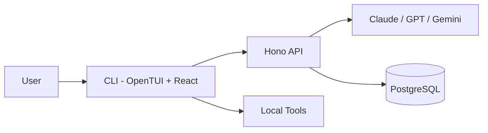

# AgentSnow

Terminal-native AI coding agent. Model-agnostic, client-executed tooling, TUI
built with React.

## How it works

AgentSnow splits across two processes:

**CLI** -- An OpenTUI + React terminal app. Manages the chat interface, session
state, and local tool execution (read/write files, shell, grep, glob). Tools run
on the client, not the server -- the server only streams model responses.

**Server** -- A Hono HTTP server. Routes chat requests to Anthropic, OpenAI, or
Gemini, gates calls behind credit checks (Polar.sh), and persists sessions to
PostgreSQL via Prisma.

A shared types package keeps tool schemas (Zod) and model metadata synchronized
between both layers.

## Tech stack

| Layer | Technology |
|-------|------------|
| Runtime | Bun |
| TUI | OpenTUI, React 19, React Router 8 |
| AI SDK | Vercel AI SDK 7 |
| Server | Hono |
| Database | PostgreSQL, Prisma 7 |
| Auth | GitHub OAuth, JWT, PKCE |
| Billing | Polar.sh |

## Features

- **Multi-model**: Claude Opus/Sonnet/Haiku, GPT-4.1, Gemini 2.5 -- choose per session
- **PLAN / BUILD modes**: PLAN restricts to read-only tools; BUILD enables file and shell access
- **Client-executed tools**: The model requests a tool, the CLI runs it locally, results stream back -- all latency-sensitive work stays off the server
- **Session persistence**: Conversations saved to PostgreSQL, browsable via /sessions
- **@-mention file picker**: Recursive directory autocomplete bound to the `@` key
- **4 themes**: Nightfox, Catppuccin, Dracula, Tokyo Night
- **GitHub OAuth**: PKCE flow with a local callback server -- no third-party token forwarding
- **Credit metering**: Polar.sh checkout and usage ingestion

## Architecture



The CLI and server are independent processes. The CLI embeds no model logic --
it is a rendering and tool-execution layer. The server handles routing, auth,
and billing. The server can be self-hosted or replaced with any backend that
satisfies the API contract.

## Quick start

```bash
# Prerequisites: Bun >= 1.3, PostgreSQL

git clone <url> && cd agent-snow
bun install
cp .env.example .env
# Set DATABASE_URL, API keys, and Polar.sh credentials

cd packages/db && bun run generate && bun run migrate && cd ../..

bun --filter server dev   # Terminal 1: API server
bun --filter cli dev      # Terminal 2: TUI
```

## Commands

| Command | Description |
|---------|-------------|
| /agents | Toggle BUILD / PLAN mode |
| /models | Select an AI model |
| /sessions | Browse past sessions |
| /theme | Change color theme |
| /login | Sign in with GitHub |
| /upgrade | Purchase credits |

## Repository structure

```
apps/cli        Terminal UI client
apps/server     API server
packages/db     Prisma schema and database client
packages/shared Shared types, Zod schemas, model configs
```

## Why build this

Existing AI coding tools couple the agent to a specific model provider, a
proprietary IDE extension, or both. AgentSnow is a standalone client that
decouples the interface from the intelligence layer -- you bring your own API
keys and own your data.
