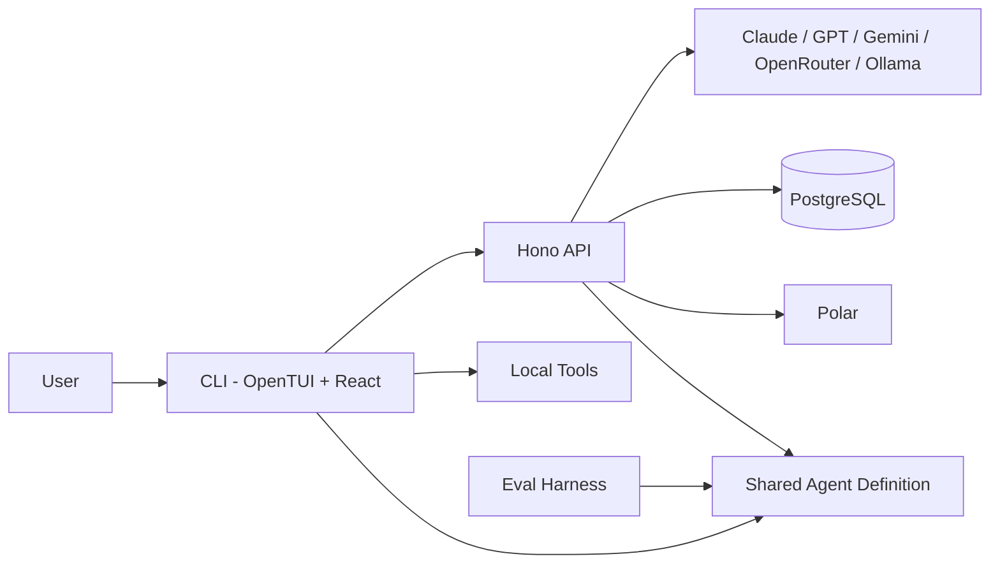

# AgentSnow

Terminal-native AI coding agent. Model-agnostic, client-executed tooling, TUI
built with React.

## How it works

AgentSnow splits across two processes:

**CLI** -- An OpenTUI + React terminal app. Manages the chat interface,
approvals, session controls, and local tool execution. Tools run on the client,
not the server.

**Server** -- A Hono HTTP server. Handles GitHub OAuth, routes model requests,
checks and records Polar credits, compacts long conversations, and persists
sessions to PostgreSQL through Prisma.

A shared types package keeps tool schemas (Zod) and model metadata synchronized
between both layers.

## Tech stack

| Layer    | Technology                        |
| -------- | --------------------------------- |
| Runtime  | Bun                               |
| TUI      | OpenTUI, React 19, React Router 8 |
| AI SDK   | Vercel AI SDK 7                   |
| Server   | Hono                              |
| Database | PostgreSQL, Prisma 7              |
| Auth     | GitHub OAuth, JWT, PKCE           |
| Billing  | Polar.sh                          |

## Features

- **Multi-model**: Claude Opus/Sonnet/Haiku, GPT-4.1, Gemini 2.5 -- choose per session
- **PLAN / BUILD modes**: PLAN restricts to read-only tools; BUILD enables file and shell access
- **Client-executed tools**: The model requests a tool, the CLI asks for approval when needed and runs it locally
- **Session persistence**: Conversations are stored as ordered PostgreSQL message rows and browsable through `/sessions`
- **@-mention file picker**: Recursive directory autocomplete bound to the `@` key
- **4 themes**: Nightfox, Catppuccin, Dracula, Tokyo Night
- **GitHub OAuth**: Server-authoritative OAuth with signed state and a temporary local CLI callback
- **Credit metering**: Polar checkout, balance checks, cache-aware model pricing, and usage ingestion
- **Context management**: Context usage is visible in the TUI and older turns are compacted near model limits

## Architecture



The CLI and server are independent local processes. The shared agent package
keeps prompts, model configuration, tools, context handling, and the headless
evaluation runner aligned. The server retains model keys, authentication,
billing, and persistence responsibilities.

## Quick start

```bash
# Prerequisites: Bun >= 1.3, PostgreSQL
# Windows users: install Git Bash (Git for Windows) for full shell support

git clone <url> && cd agent-snow
bun install   # also generates the Prisma client automatically
cp .env.example .env
# Set DATABASE_URL, JWT_SECRET, GitHub OAuth credentials, model API keys,
# and Polar credentials. Register http://localhost:3000/auth/callback as the
# GitHub OAuth callback URL.

cd packages/db && bun run migrate && cd ../..

bun --filter server dev   # Terminal 1: API server
bun --filter cli dev      # Terminal 2: TUI
```

## Commands

| Command   | Description                   |
| --------- | ----------------------------- |
| /new      | Start a new conversation      |
| /agents   | Select BUILD or PLAN mode     |
| /models   | Select an AI model            |
| /thinking | Select model reasoning effort |
| /sessions | Browse past sessions          |
| /theme    | Change color theme            |
| /login    | Sign in with GitHub           |
| /logout   | Clear the current login       |
| /upgrade  | Purchase credits              |
| /usage    | Open the Polar billing portal |
| /exit     | Quit AgentSnow                |

## Repository structure

```
apps/cli        Terminal UI client
apps/server     API server
apps/harness    Eval harness: sandboxed task runner + fixtures (bun --filter harness eval)
packages/agent  Headless agent core: runAgent loop, local tool execution, system prompt
packages/db     Prisma schema and database client
packages/shared Shared types, Zod schemas, model configs
```

## Security

PLAN mode exposes only read-only tools and fails closed when mode metadata is
missing or invalid. File tools resolve canonical paths and reject access outside
the selected working directory, including traversal through symlinks.

BUILD mode can write files and execute commands after interactive approval.
Approved non-destructive operations are remembered for the current session;
destructive commands prompt every time. Shell commands are not sandboxed or
containerized. They run locally with the same operating-system permissions as
the CLI and can access paths outside the working directory.

The CLI stores only a short-lived server JWT in `~/.snow/auth.json` and attempts
to restrict that file to the current user. It does not store the GitHub access
token.

## Development

```bash
bun run test         # All test suites (agent tools, harness driver, fixture checks)
bun run check-types  # Type-check all packages
bun --filter harness eval --list   # List eval fixtures
bun --filter harness eval          # Run all fixtures (needs a model API key)
```

## Headless mode

Automation can run the real agent without starting the TUI:

```bash
bun --filter cli headless -p "Inspect the project" --output json --agent-mode PLAN --thinking low --cwd .
```

The command emits versioned JSON lines to stdout. Diagnostics go to stderr.
The exported `runHeadless` function provides the same protocol to Bun scripts.

Run `snow update --models` to refresh OpenRouter models and models installed in
the local Ollama service. The catalog is stored in `~/.snow/models.json` and is
loaded on the next CLI or server start. Set `OPENROUTER_API_KEY` for OpenRouter;
Ollama defaults to `http://localhost:11434` and can be changed with
`OLLAMA_BASE_URL`.

## Why build this

Existing AI coding tools couple the agent to a specific model provider, a
proprietary IDE extension, or both. AgentSnow is a standalone client that
decouples the interface from the intelligence layer -- you bring your own API
keys and own your data.
