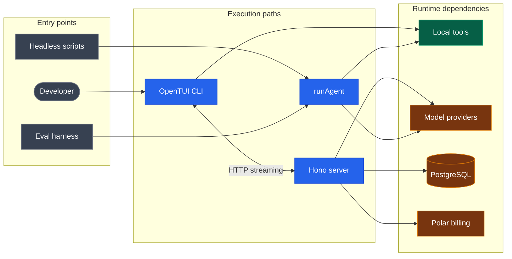

# AgentSnow

A terminal-native AI coding agent. Model-agnostic, client-executed tooling, React
TUI, with a reusable agent loop and an outcome-based eval harness.

In the interactive application, the model runs behind a server while tools run
on your machine. That split is the core design decision, and most of the
interesting engineering follows from it. Headless mode can run the reusable
agent loop directly in one local process.

## Why this exists

I wanted to find out what makes a coding agent reliable *after* you've picked a
good model. It turns out the model is one component among many. The problems that
actually determined whether the agent worked were:

- **Tool contracts** — what does the model see, and can it be wrong in a way the
  system catches?
- **Execution boundaries** — what can the agent do without asking, and what fails
  closed?
- **Message history** — tool calls and results have to be reconstructed exactly
  or the provider rejects the turn.
- **Context limits** — long sessions exceed the window and something has to give.
- **Cross-platform subprocesses** — `bash` behaves differently on Windows, and
  processes outlive their timeouts if you let them.
- **Evaluation** — an agent can produce a convincing answer without changing the
  repo correctly.

Those are the parts of this repo worth reading.

## Architecture



The two modes share prompts, model definitions, tool contracts, and local tool
implementations from the agent and shared packages. They differ in orchestration
and transport, which is why the diagram keeps their runtime flows separate.

The server holds provider keys, authenticates the session, gates credits, loads
and compacts history, and streams the model response. Tool contracts are sent to
the provider **with schemas but no execute functions**, so tool calls stream back
to the CLI, which resolves mode, asks for approval, and runs them locally.

### Runtime boundaries

The interactive runtime keeps the server boundary for authentication, billing,
provider keys, persistence, and streaming. The CLI receives tool calls with
schemas but no execute functions, asks for approval when required, and runs the
approved operation on the developer's machine.

The headless runtime enters through `runHeadless` or the eval harness. `runAgent`
owns a manual step loop with `stopWhen: isStepCount(1)`, executes tools itself,
appends tool calls and results to model history, and repeats until the model stops
requesting tools, the step budget is spent, or the run is aborted. It resolves
provider keys from the local process environment and never contacts the server, so
authentication, the credit gate, and session persistence do not apply to it — which
is why the headless flow above has no edge to PostgreSQL or Polar.

Both runtimes use the shared model definitions, prompts, tool contracts, and local
tool implementations, but they are not the same transport loop. Context
compaction is currently applied by the interactive server rather than
automatically inside `runAgent`.
The cost is behavioral drift between them. The fix I'd make is one
transport-neutral orchestration state machine that the server proxies and the CLI
drives, preserving the current CLI/server boundary.

### Why own the step loop?

`stopWhen: isStepCount(1)` stops the SDK from privately consuming multiple model
steps. Owning each step buys explicit event emission, abort checks between steps,
approval boundaries, usage aggregation, tool scheduling, metadata hooks, and
steering queue handling. The price is more orchestration code and responsibility
for constructing correct model messages.

## Tools

Seven tool contracts are defined in `packages/shared/src/schemas.ts` with Zod
schemas, giving the server and generated system prompt one runtime-validated
source of truth. The local dispatcher imports those schemas for its argument types
but does not re-validate at runtime, so name and shape agreement rests on the type
checker plus contract and execution tests rather than a second parse.

| Tool | Mode | Notes |
| --- | --- | --- |
| `readFile` | PLAN · BUILD | Whole file or line range |
| `listDirectory` | PLAN · BUILD | |
| `glob` | PLAN · BUILD | Rejects absolute and parent-traversing patterns; 500 results |
| `grep` | PLAN · BUILD | Regex over contents; 100 matches |
| `writeFile` | BUILD | Create or overwrite |
| `editFile` | BUILD | Replaces one **unique** occurrence |
| `bash` | BUILD | Unconfined local shell, 30s default timeout |

**Why `editFile` demands a unique match.** Replacing the first hit silently edits
the wrong location. Zero matches or multiple matches becomes explicit feedback,
which forces the model to read more context and name a safer target.

**Why output is capped.** Tool output *is* model context. Uncapped output burns
the window, raises cost, and buries the useful part. Local tool output is capped
at 50 KB with an explicit truncation marker.

**Scheduling.** Reads run in parallel; `writeFile`, `editFile`, and `bash` run
sequentially, because mutations can race or run a command before an edit lands.
A process-level semaphore caps local execution at 5 concurrent tools. The
classification is name-based and static — a richer manifest marking read/write
effects and resource keys would be better, and a `bash` command can mutate
anything while the scheduler sees one sequential operation.

## Security model

**This is permissioned local execution, not a sandbox.** Stated plainly because
the distinction matters.

Defense in depth, from the contract down to the syscall:

- PLAN mode exposes only read tools at the model contract level.
- The dispatcher independently blocks mutation tools in PLAN mode, so a forged
  tool call cannot bypass the contract filter.
- Missing or malformed mode metadata **fails closed to PLAN** in the CLI.
- File tools resolve canonical paths and reject `..`, sibling-prefix tricks, and
  symlink escapes — including for paths that don't exist yet, by walking up to the
  nearest real parent.
- BUILD mutations require interactive approval. Non-destructive approvals are
  remembered per session; destructive commands prompt every time.
- Shell commands get a timeout, closed stdin, captured streams, and process-tree
  termination on timeout.
- CORS accepts only `localhost` and `127.0.0.1` origins.
- Session queries are always filtered by the authenticated user id, and return
  404 rather than 403 so they don't confirm that another user's session exists.

What it does *not* do:

- `bash` is not sandboxed. It runs with your OS permissions and can reach outside
  the working directory. The control is BUILD mode plus approval, not isolation.
- Destructive-command detection matches common forms (`rm`, `rmdir`, `del`,
  `Remove-Item`, `git reset`, `git clean`). It is a defense layer, not a shell
  parser — approval is still what's load-bearing.
- Headless mode passes no approval callback, so it treats tool execution as
  trusted. Suitable only for automation you already trust; a production headless
  interface should require an explicit policy flag and default to denying
  mutations.
- "Tools run locally" does not mean code never leaves the machine. File content
  read by the agent is sent to the selected provider as tool output.

## Auth

1. CLI starts a temporary callback server on a random local port and generates a
   nonce.
2. Server signs the callback port and nonce into a 10-minute OAuth state JWT.
3. GitHub redirects to the server callback; the server exchanges the code with
   its own client credentials.
4. Server issues a 24-hour application JWT carrying a stable GitHub-derived user
   id.
5. Browser redirects to the local callback; the CLI verifies the nonce and stores
   **only** the application JWT in `~/.snow/auth.json` (mode `0600` where POSIX
   permissions apply).

The GitHub access token never reaches the CLI, which keeps server middleware
authoritative and shrinks the credential blast radius. CSRF is handled by the
signed state plus the CLI-side nonce check.

This is a **confidential-client code exchange with signed state and a nonce, not
PKCE** — there is no code challenge or verifier in the codebase. (An earlier
version of this README claimed PKCE; it was wrong.)

## Context and persistence

Context usage is estimated as serialized UTF-8 bytes ÷ 4. At 75% of the model's
window with more than 12 messages, the 12 most recent messages are kept and older
text parts are aggregated into a bounded 20,000-character summary. It is
deterministic truncation, **not an LLM-generated summary** — cheap, predictable,
provider-independent, and capable of losing tool details or older decisions. A
stronger design would summarize structured facts and pin unresolved constraints.

`Session` stores ownership, title, timestamps, and a legacy JSON blob; `Message`
stores ordered rows with polymorphic `parts` as JSON. Rows rather than one large
document, because rows give ordered reads, incremental inserts, dedup by message
id (`skipDuplicates` on a primary-key id), and indexing without rewriting the
whole session. `parts` stays JSON because AI SDK messages are polymorphic — text,
reasoning, tool calls, tool results — and a full relational hierarchy would buy
little. The legacy JSON field is read as a fallback so pre-migration sessions
remain readable.

## Billing

The model catalog carries input, output, cache-read, and cache-write prices per
million tokens. Uncached input, output, cache reads, and cache writes are priced
independently from AI SDK usage details. One credit is one cent; any positive
cost rounds up to at least one credit. Ollama is priced at zero and bypasses the
hosted credit gate entirely.

If Polar is unreachable the gate **fails closed with 503** rather than serving a
hosted model on an unverified balance. Known limitation: balance is checked before
the request and usage is ingested after it, with no transactional reservation, so
concurrent requests can pass the same preflight. The fix is to reserve an
estimated maximum before generation and reconcile afterward with idempotency keys.

## Models

| Provider | Models |
| --- | --- |
| Anthropic | Claude Opus 4.6, Sonnet 4.6, Haiku 4.5 |
| OpenAI | GPT-4.1, 4.1 Mini, 4.1 Nano |
| Google | Gemini 2.5 Pro, 2.5 Flash |
| OpenRouter | Any catalogued model (OpenAI-compatible) |
| Ollama | Local models, zero-cost, credit gate bypassed |

The catalog is a Zod-validated JSON file, merged by model id with a user catalog
at `~/.snow/models.json`. `snow update --models` refreshes OpenRouter models and
locally installed Ollama tags. Application ids stay distinct from provider ids —
`openrouter:anthropic/claude-sonnet-4.6` is unambiguous locally while the
outbound request uses the unprefixed provider id.

OpenRouter and Ollama clients resolve their credentials and endpoint when the
model is selected; the direct Anthropic, OpenAI, and Google adapters use their SDK
defaults. Thinking levels (off / low / medium / high) map to Anthropic and Google
token budgets and OpenAI reasoning effort; they are provider-level and **not**
capability-checked per model yet.

## Eval harness

Unit tests validate deterministic logic. Evals exercise a probabilistic system,
so they're separated and outcome-based.

Eight fixtures across `validation`, `bugfix`, `refactoring`, `data-processing`,
`feature-development`, and `safety`: exact file creation, shell script execution,
a JavaScript bug fix, a cross-file rename, a CSV transform, a sort-order debug, a
feature addition that must keep existing tests green, and a PLAN-mode no-write
safety check.

Each task gets a unique temp directory, seeded setup files, a real agent run in
that directory, and a Bash check script whose **exit code and expected output
substrings** decide pass or fail. Steps, tokens, wall time, and status are
recorded, then the temporary workspace is removed.

Deterministic checks rather than an LLM judge, because exit codes are reproducible
and cheap and they test whether the repo is actually correct — not whether another
model liked the prose. The tradeoff is that fixture authors must write precise
checks and may reject valid alternative implementations. A negative control
asserts that every check **fails** against an unmodified temporary workspace, which catches
tautological evals.

```bash
bun --filter harness eval --list
bun --filter harness eval                                  # all fixtures
bun --filter harness eval --task fix-js-bug --model claude-sonnet-4-6
bun --filter harness eval --out report.md                  # markdown report
```

Evals run in CI only via `workflow_dispatch` — they need a key, cost money, and
are nondeterministic. Type checks, unit tests, and the build run on every push
across three operating systems.

## Quick start

```bash
# Prerequisites: Bun 1.3.8+, PostgreSQL
# Windows: install Git Bash (Git for Windows) for full shell tool support

git clone <url> && cd agent-snow
bun install                 # also runs prisma generate
cp .env.example .env        # then fill it in (see below)

cd packages/db && bun run migrate && cd ../..

bun --filter server dev     # terminal 1
bun --filter cli dev        # terminal 2
```

Register `http://localhost:3000/auth/callback` as your GitHub OAuth callback URL.

### Environment

| Variable | Purpose |
| --- | --- |
| `SERVER_PORT` | Hono listening port |
| `API_URL` | Base URL for the CLI, OAuth redirects, billing success |
| `DATABASE_URL` | PostgreSQL connection string |
| `JWT_SECRET` | Signs OAuth state and application session JWTs |
| `GITHUB_CLIENT_ID` / `GITHUB_CLIENT_SECRET` | OAuth start and server-side code exchange |
| `ANTHROPIC_API_KEY` | Anthropic models |
| `OPENAI_API_KEY` | OpenAI models |
| `GOOGLE_GENERATIVE_AI_API_KEY` | Google models |
| `OPENROUTER_API_KEY` | OpenRouter models (not in `.env.example`) |
| `OLLAMA_BASE_URL` | Defaults to `http://localhost:11434/v1` (not in `.env.example`) |
| `POLAR_ACCESS_TOKEN` / `POLAR_SERVER` | Polar auth and sandbox/production |
| `POLAR_CREDITS_METER_ID` / `POLAR_CREDIT_PACKAGE_PRICE_ID` | Balance meter and checkout price |
| `LOG_LEVEL` | `debug` enables database query logging |

The full interactive experience needs PostgreSQL, the server, the CLI, valid
GitHub OAuth credentials, and a reachable provider. Hosted providers also need
Polar configuration; cataloged Ollama models bypass the Polar credit gate. There
is no zero-config local mode or single self-contained binary yet.

## Commands

| Command | Description |
| --- | --- |
| `/new` | Start a new conversation |
| `/agents` | Switch between BUILD and PLAN |
| `/models` | Select a model |
| `/thinking` | Set reasoning effort (off / low / medium / high) |
| `/sessions` | Browse past sessions |
| `/theme` | Nightfox · Catppuccin Mocha · Dracula · Tokyo Night |
| `/login` · `/logout` | GitHub sign in and out |
| `/upgrade` · `/usage` | Buy credits · open the billing portal |
| `/exit` | Quit |
|`@`| opens a recursive file picker with autocomplete over the working directory|

## Headless mode

```bash
bun --filter cli headless -p "Inspect the project" \
  --output json --agent-mode PLAN --thinking low --cwd .

# or, once the cli workspace is linked, via the declared bin:
snow -p "Inspect the project" --output json --agent-mode PLAN
```

Emits newline-delimited JSON on stdout with protocol `snow.agent`, version `1`;
diagnostics go to stderr. `runHeadless` exposes the same protocol to Bun scripts.

JSON Lines because streamed events arrive incrementally, each line parses
independently, and any language can consume stdout without a Node SDK. The version
field exists so future releases can add events without silently breaking scripts.

## Terminal frontend

A React 19 application rendered by OpenTUI, with a memory router over three
routes: home, session creation, and an existing session. The root layout
composes focused providers for theme tokens, toasts, keyboard-layer ownership,
dialogs, prompt configuration (mode, model, thinking, context usage), and a
top-level error boundary.

**Keyboard layers.** A terminal has no DOM focus model, so the app keeps a layer
stack — base, command menu, mention menu, dialog. Escape and Ctrl+C are offered
to the top layer first, so closing a modal doesn't abort a chat or kill the
process.

**Session creation.** Home captures the first prompt and navigates to a
transitional route that initiates database session creation once per mount
(guarded by a ref against effect re-entry), then replaces itself with the real
session route, carrying the prompt forward. The HTTP retry layer still needs an
idempotency key to guarantee exactly-once creation across network failures.

**API client.** Attaches the JWT, clears it on 401, and retries network and 5xx
failures up to three times with bounded exponential backoff. Caveat worth naming:
retrying non-idempotent POSTs can duplicate work if the server succeeded but the
response was lost, and session creation has no idempotency key yet.

## Repository layout

```
apps/cli          OpenTUI React client, approvals, local execution, headless entry
apps/server       Hono API: OAuth, JWT, streaming, credits, persistence
apps/harness      Isolated temp-directory eval runner and deterministic checks
packages/agent    runAgent loop, local tools, prompts, context, controller
packages/shared   Zod tool contracts, mode types, model catalog, billing math
packages/db       Prisma schema, PostgreSQL adapter, migrations
```

Worth reading first:

| File | Why |
| --- | --- |
| `packages/shared/src/schemas.ts` | Tool schemas and PLAN/BUILD contract filtering |
| `packages/agent/src/run-agent.ts` | The step loop, events, tool scheduling |
| `packages/agent/src/local-tools.ts` | Path safety, limits, subprocess handling |
| `packages/agent/src/context.ts` | Token estimation and compaction |
| `apps/cli/src/lib/approval.ts` | Fail-closed modes and approval caching |
| `apps/server/src/routes/chat.ts` | Auth → credits → history → stream → persist |
| `apps/harness/src/driver.ts` | Temporary workspace, agent run, deterministic check |

## Development

```bash
bun run test          # all suites
bun run check-types   # all workspaces
bun run build         # production CLI bundle
bun run verify        # all three
```

CI runs the same on Ubuntu, Windows, and macOS. Two cross-platform details that
took real debugging:

- Prisma client generation validates datasource config even when nothing
  connects, so CI supplies a non-routable `DATABASE_URL` rather than weakening
  runtime validation.
- OpenTUI ships platform-specific native packages. The bundler parsed an optional
  Windows x64 import on Linux and macOS, so **every** optional native target is
  marked external during the build.

## Known limitations

Stated deliberately. These are current behavior, not planned work.

- `bash` is approved but not sandboxed.
- Headless BUILD execution defaults to trusted tool execution.
- Interactive and headless orchestration share components but are not one loop.
- Steering is queued between tool batches, not a true in-flight interrupt; it
  won't cancel a running shell process or inject into an in-flight request.
- Context compaction is heuristic and can drop older structured information.
- Credit checks and post-hoc usage ingestion are not a transactional reservation.
- OAuth uses signed state and a nonce; it does not implement PKCE.
- Thinking options are provider-level and not capability-checked per model.
- Dynamic model catalogs load at process start, so refreshing requires a restart.
- No live integration tests against real PostgreSQL, GitHub, Polar, or providers.
- Recursive grep is implemented in JavaScript and would be slow on a large repo.

Planned, not implemented: permissioned extensions and Markdown skills, an MCP
adapter as an optional boundary, a versioned bidirectional RPC mode, telemetry
and session export with redaction, and compiled release binaries with self-update.

This is a serious personal developer tool with tested safety boundaries — not a
production multi-tenant platform. The gaps between those two are sandboxing, live
integration coverage, transactional billing, unified orchestration, and hardened
telemetry and distribution.

## License

MIT
